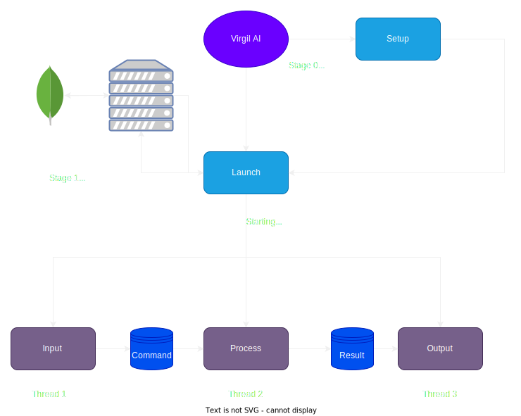

# Virgil AI (Assistent Interface)

<style>
r { color: Red }
o { color: Orange }
g { color: Green }
b { color: Blue }
v { color: Purple }
c { color: Cyan }
y { color: Yellow }
</style>

## Index

- **[Introduction](#introduction)**
- **[How Virgil Works](#💻-how-virgilai-works)**
- **[Installing](#installation)**
- **[Setup](#📖-setup)**
  - [Guide to settings](#📚-guide-to-local-setting)
  - [ElevenLabs](#guide-to-elevenlabs)
- **[First start](#first-start)**
  - [How to use](#how-to-use)
- **[Problem with mic?](#🎙️-guide-to-microphone)**
- **[Why all this key?](#why-the-key-of-openaielevenlabs-and-merros❓)**
  - [Generate other key](#🔁-change-the-key)
- **[Security](#security)**
- **[Notes](#notes)**
- **[Other](#other)**
  - [App](#mobile-app)
  - [Websites](#website)
  - [Model of ML](#analysis-of-ml)
- **[Credits](#credits)**
  - [Contact me]()

---


[](https://scrutinizer-ci.com/g/Retr0100/VirgilAI/?branch=master)

## Introduction

Created principle with [python3.11](https://www.python.org/downloads/) e various library like [SpeechRecognition](https://pypi.org/project/SpeechRecognition/)  and [TTS library](https://pypi.org/project/gTTS/)

Virgilo or Virgil is a virtual assistant like Alexa or Google Home, but integrated with an AI (GPT-3.5 turbo).Designed to give the user the ability to use it and do what they want with it from putting it on a rasperry and using it as alexa to integrating it with their device whether it's linux or windows. With the possibility to set your own settings according to the need from where and when you want

### 🔑 Key features

**You can ask lots of questions at Virgilio, like us:**

- The time ⏲️
- The weather 🌧️
- The lates news 🗞️
- Change the volume 🔉
- The temperature 🌡️
- Days of the week 📆
- Interact with the domotic (Merros device only) 💡
- Timer 🔂
- Ask a Virgil to remember your commitments 🗓️
- Mediaplayer 🎵
- and ask **whatever you want** like: Virgilio explain quantum math 🤖
  
**Is fast to use:**

- In fact all you have to do is insert the key in the app and you're done ✅
  
**Portable:**

- You can put it on any linux/windows device including mac 🌐

## 💻 How VirgilAI works  # TO REMAKE

<p align="center">
 
</p>

## 📋 Installing

### Obligatory prerequisites

- <c>Python 3.11>=</c>
- <c>Key of GPT3.5>=</c>

### Installation

1. The first part of the installation is to **download** all the files from the repository
   - command linee ```git clone https://github.com/Retr0100/VirgilApp.git```
   - or download the zip
2. Now we need the **api** (for now i am not rich and i do not pay for everything) so
 we are need of 3 api keys (the keys marked with * **are mandatory** for operation)
   - <y>API for OpenAI and GPT</y>,
          i recommend this [video tutorial](https://www.youtube.com/watch?v=u-LeLPBZr2k) *
   - <y>API for Merros</y> (domotic socket),
          just create a [Merros account](https://www.meross.com/en-gc) and insert the credential
   - <y>API for ElevenLabs</y>
       This API is not required, but if you want a [BEST EXPERIENCE](https://elevenlabs.io/speech-synthesis) i raccomand you to get

3. When you have all the keys/accounts, save them on any file

## Notes ❗ #TO  UPDATE

<r>**THIS IS NOT OBBLIGATORY.**</r>  
 Before the user on Linux (preferably, but also on Windows it would not be) create an enviroment with venv ```python -m venv name_enviroment``` after writing ```source name_enviroment/bin/activate```.
 Now you can install all the dependencies without putting your PC at risk.
 To close the environment, just run ```deactivate```.
 If you use the enviroment try Virgil only whith the text interface

## 📖 Setup

### When you have installed and downloaded the API you can start setup Virgilio 🥡

 1. Open a terminal to the directory VirgilAI/setup run the command ` pip install -r requirements.txt ` this install some requirements for run the setup file
 2. Now still in the VirgilAI folder, run the command `python or python3 setup.py`
 3. Once we have finished setting up the environment through the setup programme, we can run virgilio **BUT BEWARE THERE ARE SO MANY OTHER THINGS WE CAN SET**

### 📚 Guide to **LOCAL** setting

- **<g>Virgil settings</g>**
  - <o>**Launch Startup**</o>: The programme will be started every time the PC is started.
  - **<o>Default interface type**</o>: You can choose whether to start virgilio with a text or voice interface by default (if you do not wish to set a default interface, you will be asked each time).
  - **<o>Run without console (background)**</o>: Virgil will be started and run in the background, without a console (This option is only available if voice intercom is used).
- <g>**Debug settings** (You can also ignore them)</g>
  - **<o>Debug level**</o>: You can decide which debug level can be displayed on the screen by default it is set to info (So all logs above and equal to info will be shown, at first not advisable)
  - **<o>Write in file**</o>: Scrittura dei logs in un file (Se saranno scritti un in file non verranno visualizzati a schermo)

### 📚 Guide to **ONLINE** setting

<o>**Difference between online and local settings**</o>

- <g>**Local**</g>: Local settings are obviously not synchronised on each device and will have to be setup for each environment, and some settings such as debugging settings can be set directly from code and without too much effort
- <g>**Online**</g>:Online settings will be synchronised on each device but can only and only be changed via the APP, which unfortunately is only available for android.

``` json
// THE VALUES ON THE JSON ARE THE DEFAULT
{
    "language": "it", //The launguage for now is useless sorry
    "wordActivation": "Virgilio", //The word on Virgil can Activate
    "volume": "100.0", // Set the start volume of Virgil
    "city": "Salerno", // City default for the Meteo
    "operation_timeout": "3", // Listening time if you don't tal 
    "dynamic_energy_threshold": "true", // Automatic and dynamic microphone sensitivity
    "energy_threshold": "3500", //Sensitivy of microphone                                     
    "elevenlabs": "aaaaaaaaaaaaaaaaaaaaaaaaaaaaaaaa", //Key for elevenlabs                  
    "openAI": "sk-aaaaaaaaaaaaaaaaaaaaaaaaaaaaaaaaaaaaaaaaaaaa", //Key for openAI
    "merrosEmail": "email", //Credential for merros                                                                
    "merrosPassword": "password", //Credential for merros                                                               
    "temperature": "0.9", //Randomness of GPT responses
    "max_tokens": "30" //Max lenght phrase of GPT                                                                       
}                                                                                                                      
```

### Guide to ElevenLabs

Elevenlabs is a service to reproduce tts by deeplearning and the key is free but is necessery an account but the token are very few...
**But is there a trick** to having <o>**UNLIMITED**</o> accounts with the same email

<c>**Explanation:**</c>

  1. Take a any gmail
  2. add a dot anywhere in the email
  3. And the email of confirmation will be sent

<c>**Example:**</c>

Original email: `example@gmail.com`
Email with dots added: `example.@gmail.com` or `e.xample@gmail.com`

## First start

The first start-up of Virgilio will be quite important because you will be generated an **IMPORTANT** key for configuring Virgilio via the APP

<o>**Important notes:**</o>

- The first start will be the **same for all**, without taking into account the settings previously made with the setup.py programme, so once you have taken the key and **saved** it in a file for safety, you will need to restart virgilio.
- You can only generate a <r>**MAXIMUM**</r> of 5 keys per machine
- The first time you start Virgil immediately after booting, it will be much slower than a normal start. This is because Python, and Virgil in general, is **optimised** so that the more starts it has in a session, the faster it will start.

### How to use

## 🎙️ Guide to Microphone

### **Problem**

**The recognizer tries to recognize speech even when I’m not speaking, or after I’m done speaking.**

### Solution

Try increasing the recognizer_instance.energy_threshold property. This is basically how sensitive the recognizer is to when recognition should start. Higher values mean that it will be less sensitive, which is useful if you are in a loud room.

I created this tool for you (the tool is included in the repository) 💓

``` python
import math
import speech_recognition as sr
import time
listener = sr.Recognizer()
def main(languageChoose:str):
    print("SAY A WORD OR PHRASE IN YOUR LANGAGE")
    resultDict = {}
    for i in range(5):
        try:
            with sr.Microphone() as source:
                print(f"{i}. SPEAK")
                start_time = time.time()
                voice = listener.listen(source,3,15)
                command = listener.recognize_google(voice,language=languageChoose)
                end_time = time.time()
                resultDict[i] = [listener.energy_threshold,command,end_time - start_time]
        except:
            pass
    return resultDict
if __name__ == "__main__":
    listener.operation_timeout = 2
    listener.dynamic_energy_threshold = True
    languageChoose = str(input("Insert your language nation and dialet if is not dialet simple repeate the nation example it-it: "))
    results  = main(languageChoose)
    sorted_keys = sorted(results.keys(), key=lambda key: results[key][2])
    sorted_dict = {key: results[key] for key in sorted_keys}
    print(f"Recommended value:  {math.ceil(list(sorted_dict.values())[0][0])}")
```

The tool is not **100%** accurate but it is a great way to get a <g>**starting**</g> idea if you see that virgil is not accurate enough in recognizing when you speak and when you don't try adjustment

### Why the key of OpenAI,ElevenLabs and Merros❓

- <g>**Virgil**</g>: The Virgilio configuration key is used to synchronise all online settings... <r> **DO NOT GIVE THE KEY TO ANYONE AND DO NOT EXPORT IT TO ANYONE OR YOU WILL GET ALL YOUR KEYS**</r> (OpenAI,Elevenlabs etc)
- <g>**OpenAI**</g>: This is in fact the only mandatory key, as GPT covers 50% of the application, and this is the real **difference** to Alexa and Virgil.
- <g>**ElevenLabs**</g>: This key is not mandatory but it makes the experience more pleasant because ElevenLabs implements a more natural Speech To Text (TTS) and also allows you to choose your own voice. If you can't use the key, Virgil will still work, but with Google's TTS
 and it's not the best choice 😅.
- <g>**Meross**</g>: This credential an required **ONLY** if you can use a domotic Meross but if you dont have a domotic Meross don't waste time ⏲️

### How to change the voice for TTS ElevenLabs

1. Go in this file ```lib/sound.py```
2. Go on the site of [ElevenLabs](https://elevenlabs.io/speech-synthesis) create an account (You should already have it)
3. Explore the default Voice and choice one
4. Now on this part of file ```sound.py```

    ``` python

    sound = generate(
                      api_key = self.API_KEY,
                      text=text,
                      voice="Antoni",
                      model='eleven_multilingual_v1'
                    )
    ```

    And replace the voice whith the one you want (if after the TTS dont'work try another voice on whatch a video on YT on how to use default entries )
5. Restart Virgil

<y>**WARNING!!:**</y> In order to save ElevenLabs tokens and increase efficiency, many phrases are pre-recorded, so there will be a difference between the voice you type and the pre-recorded voice.

### 🔁 Change the key

> Go in the directory call setup and search the key.txt (remeber the key is a hexadecimal string of 32 characters),delete it and relaunch Virgil

<y>**WARNING!!:**</y> You can generate only 5 key for device (sorry this is for limiter the spam)

## Security

This is not a topic we will be exploring in depth at the moment, but each key is managed in a hosting system that encrypts communications and uses various string sanitisation and controls against ddos and other attacks, but I believe that security can never be too much, so...
If you discover a vulnerability in Virgil, please send an email to <projectvirgilai@gmail.com>. All vulnerabilities will be reported immediately.

## Notes

- In this paragraph I will add secondary elements or updates released

## Other

As mentioned above VirgililAI is part of a larger project that includes App, Website, and others the links at project are:

### [Website](https://projectvirgil.net)

### [Mobile APP](https://github.com/Retr0100/VirgilApp)

### [Analysis of ML](https://github.com/Retr0100/VirgilML)

## Credits

The project are maded by one person and is still under development I am looking for someone who can give me advice and a hand to continue the project which I believe is an excellent open source and free alternative to devices such as Alexa or Google Home

### Contact me

For code-related problems you can use github directly for other collaborations or warnings write to this email <projectvirgilai@gmail.com>

### License

- AGPL-3.0 license
- [LICENSE](https://github.com/Retr0100/VirgilAI/blob/master/LICENSE)
