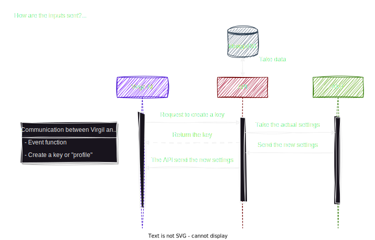
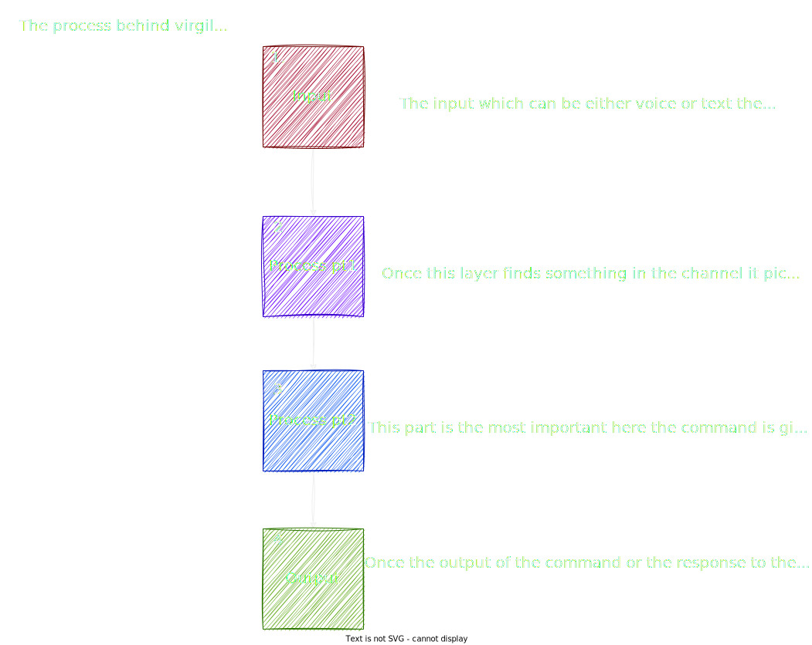

# Virgil AI 🏛️ (Assistant Interface)  | Last docs update: 27/11/2023 (d/m/y)

## Index

- **[Introduction](#introduction)**
- **[How Virgil Works](#-how-virgilai-works)**
- **[Installation](#installation)**
- **[Setup](#-setup)**
  - [Guide to settings](#guide-to-local-settings)
  - [ElevenLabs](#guide-to-elevenlabs)
- **[First start](#first-start)**
  - [How to use](#how-to-use)
  - [Possible python bugs](#python-bugs)
  - [Env bugs](#env-bugs)
- **[Problem with mic?](#%EF%B8%8F-guide-to-microphones)**
- **[Why all this key?](#why-the-key-of-openai-elevenlabs-and-merros)**
  - [Generate other key](#-change-the-key)
- **[Security](#security)**
- **[Notes](#notes)**
- **[Other](#other)**
  - [App](#mobile-app)
  - [Websites](#website)
  - [Model of ML](#analysis-of-ml)
- **[Credits](#credits)**
  - [Contact me](#contact-me)

---


[](https://scrutinizer-ci.com/g/Retr0100/VirgilAI/?branch=master)

## Introduction

Created in principle with [python3.11](https://www.python.org/downloads/) and various libraries such as [SpeechRecognition](https://pypi.org/project/SpeechRecognition/) and [TTS library](https://pypi.org/project/gTTS/).

Virgilo or Virgil is a virtual assistant like Alexa or Google Home, but integrated with an AI (GPT-3.5 turbo).Designed to give the user the ability to use it and do what they want with it, from putting it on a rasperry and using it as alexa to integrating it with their device whether it's linux or windows. With the possibility to set your own settings according to your needs, from where and when you want.

### 🔑 Key features

**You can ask many questions on Virgilio, like us:**.

- The time ⏲️
- The weather 🌧️
- The latest news 🗞️
- Change the volume 🔉
- The temperature 🌡️
- Days of the week 📆
- Interact with the domotic (Merros device only) 💡
- Timer 🔂
- Ask a Virgil to remember your commitments 🗓️
- Media player 🎵
- and ask **whatever you want** how: Virgilio explain quantum math 🤖
  
**Is fast to use:**

- In fact, all you have to do is insert the key into the app and you're done ✅
  
**Portable:**

- You can use it on any linux/windows 🌐

## 💻 How VirgilAI works

**white text**

### Example of communication with API and APP

<p align="center">
 
</p>

### Structure of Virgil

<p align="center">
 
</p>

## 📋 Installation

### Obligatory requirements

- Python 3.11
- Key from GPT3.5>=

## Installation

1. The first part of the installation is to **get** all the files from the repository.
   - Command line ```git clone https://github.com/Retr0100/VirgilApp.git```
   - or download the zip.
2. Create an environment for VirgilAI in the **directory of VirgilAI** with this command ```python -m venv virgil-env``` and activate it with this command ```virgil-env\Scripts\activate``` if the environment does not activate read the [docs of Venv](https://docs.python.org/3/tutorial/venv.html) (if use the classic cmd attach .bat at end of activate)

3. Now we need the **api** (for now I am not rich and do not pay for everything) so
 we need 3 api keys (the keys marked with * **are mandatory** for operation)
   - API for OpenAI and GPT,
          I recommend this [video tutorial](https://www.youtube.com/watch?v=u-LeLPBZr2k) *.
   - API for Merros (domotic socket),
          just create a [Merros account](https://www.meross.com/en-gc) and enter the credentials
   - API for ElevenLabs
       This API is not required, but if you want a [BEST EXPERIENCE](https://elevenlabs.io/speech-synthesis) I recommend you to get it.

1. When you have all the keys/accounts, save them to any file.

## 📖 Setup

### Once you have installed and downloaded the API, you can start the Virgilio setup 🥡

 1. Open a terminal to the VirgilAI/setup (with the env active) directory and run the command ` pip install -r requirements.txt ` This will install some requirements for running the setup file.
 2. Still in the VirgilAI folder, run the command `python or python3 setup.py`.
 3. Once we have set up the environment through the setup programme, we can run virgilio **BUT BE AWARE THERE ARE SO MANY OTHER THINGS WE CAN SET UP**.

### Guide to **LOCAL** settings

- Virgil Settings
  - **Startup**: The program will be started every time the PC is started.
  - **Default interface type**: You can choose whether to start virgilio with a text or voice interface by default (if you do not wish to set a default interface, you will be asked each time).
  - **Run without console (background)**: Virgil will start and run in the background without a console (this option is only available when using the voice interface).
- **Debug settings** (You can also ignore these)
  - Debug level: You can decide which debug level can be displayed on the screen, by default it is set to info (So all logs above and equal to info will be displayed, not recommended at first).
  - **Write to file**: Writing logs to a file (if they are written to a file, they will not be displayed on the screen)

### Guide to **ONLINE** settings

#### Difference between online and local settings

- **Local**: Local settings are obviously not synchronized on each device and need to be set up for each environment, and some settings such as debugging settings can be set directly from code without too much effort.
- **Online**: Online settings are synchronized on each device, but can only be changed via the APP, which is unfortunately only available for Android.

``` json
// THE VALUES ON THE JSON ARE THE DEFAULT
{
    "language": "it", //The launguage for now is useless sorry
    "wordActivation": "Virgilio", //The word on Virgil can Activate
    "volume": "100.0", // Set the start volume of Virgil
    "city": "Salerno", // City default for the Meteo
    "operation_timeout": "3", // Listening time if you don't talk
    "dynamic_energy_threshold": "true", // Automatic and dynamic microphone sensitivity
    "energy_threshold": "3500", //Sensitivy of microphone
    "elevenlabs": "aaaaaaaaaaaaaaaaaaaaaaaaaaaaaaaa", //Key for elevenlabs
    "openAI": "sk-aaaaaaaaaaaaaaaaaaaaaaaaaaaaaaaaaaaaaaaaaaaa", //Key for openAI
    "merrosEmail": "email", //Credential for merros                     
    "merrosPassword": "password", //Credential for merros
    "gpt-version": "gpt-3.5-turbo-0613", // The version for gpt-version                        
    "temperature": "0.9", //Randomness of GPT responses
    "max_tokens": "30" //Max length phrase of GPT
}                                                                                                                      
```

### Guide to ElevenLabs

Elevenlabs is a service to reproduce tts by deeplearning and the key is free but is necessary an account but the tokens are very few...
**But is there a trick to have **UNLIMITED** accounts with the same email?**

**Explanation:**

  1. Take any gmail
  2. Add a dot anywhere in the email
  3. And the confirmation email will be sent

**Example:**

Original email: `example@gmail.com`.
Email with dots added: `example.@gmail.com` or `e.xample@gmail.com`.

## First start

The first start of Virgilio will be quite important, as it will generate an **IMPORTANT** key for configuring Virgilio via the APP.

**Important notes:**.

- The first start will be **same for all**, without taking into account the settings previously made with the setup.py programme, so once you have taken the key and **saved** it in a file for safety, you will need to restart Virgilio.
- You can only generate a **MAXIMUM** of 5 keys per machine.
- The first time you start Virgil immediately after booting, it will be much slower than a normal start. This is because Python, and Virgil in general, is **optimized** so that the more starts it has in a session, the faster it will start.

### How to use

## 🎙️ Guide to microphones

### **Problem**

**The recognizer tries to recognize speech even when I'm not speaking, or after I've finished speaking.**

### Solution

Try increasing the recognizer_instance.energy_threshold property. This is basically how sensitive the recognizer is to when recognition should start. Higher values mean it will be less sensitive, which is useful if you are in a loud room.

I made this tool for you (the tool is in the repository) 💓

``` python
import math
import speech_recognition as sr
import time
listener = sr.Recognizer()
def main(languageChoose:str):
    print("SAY A WORD OR PHRASE IN YOUR LANGUAGE")
    resultDict = {}
    for i in range(5):
        try:
            with sr.Microphone() as source:
                print(f"{i}. SPEAK")
                start_time = time.time()
                voice = listener.listen(source,3,15)
                command = listener.recognize_google(voice,language=languageChoose)
                end_time = time.time()
                resultDict[i] = [listener.energy_threshold,command,end_time - start_time]
        except:
            pass
    return resultDict
if __name__ == "__main__":
    listener.operation_timeout = 2
    listener.dynamic_energy_threshold = True
    languageChoose = str(input("Insert your language nation and dialect if is not dialect simple repeat the nation example it-it: "))
    results  = main(languageChoose)
    sorted_keys = sorted(results.keys(), key=lambda key: results[key][2])
    sorted_dict = {key: results[key] for key in sorted_keys}
    print(f"Recommended value:  {math.ceil(list(sorted_dict.values())[0][0])}")
```

The tool is not **100%** accurate, but it's a good way to get a **starting** idea if you see that Virgil is not accurate enough in recognizing when you speak and when you don't try to adjust.

### Python Bugs

If Python give this error `ImportError: DLL load failed while importing _argkmin: File name or extension too long.`

Try to using an [venv](https://docs.python.org/3/library/venv.html) **environment** to work around the path error, so activate the env and **run everything from there.**

### Why the key of OpenAI, ElevenLabs and Merros❓

- **Virgil**: The Virgilio configuration key is used to synchronize all online settings...  **DO NOT GIVE THE KEY TO ANYONE OR EXPORT IT TO ANYONE OR YOU WILL GET ALL YOUR KEYS** (OpenAI,Elevenlabs etc)
- **OpenAI**: This is actually the only mandatory key, as GPT covers 50% of the application, and this is the real **difference** to Alexa and Virgil.
- **ElevenLabs**: This key is not mandatory, but it makes the experience more pleasant because ElevenLabs implements a more natural Speech To Text (TTS) and also allows you to choose your own voice. If you can't use the button, Virgil will still work, but with Google's TTS.
 and it's not the best choice 😅.
- **Meross**: This is **ONLY** required if you can use a domotic Meross, but if you don't have a domotic Meross, don't waste your time ⏲️

### Env bugs

If the setup give error on poetry create a venv environment with  `python -m venv name_of_env` and activate the env with this command `name_of_env\Scripts\activate.bat` (for windows) or `.\name_of_env\bin\activate` (for linux) and run the setup file

### How to change the voice for TTS ElevenLabs

1. Go to this file ```lib/sound.py```
2. Go to the [ElevenLabs](https://elevenlabs.io/speech-synthesis) website and create an account (you should already have one)
3. Explore the default voice and choose one
4. Now go to this part of the ``sound.py`` file

    ```python
    sound = generate(
                      api_key = self.API_KEY,
                      text=text,
                      voice="Antoni",
                      model='eleven_multilingual_v1'
                    )
    ```

    And replace the voice with the one you want (if after the TTS does not work try another voice on watch a video on YT on how to use default entries).
  
5. Restart Virgil.

**WARNING!!:** To save ElevenLabs tokens and increase efficiency, many phrases are pre-recorded, so there will be a difference between the voice you type and the pre-recorded voice.

### 🔁 Change the key

> Go into the directory, call setup and find key.txt (remember the key is a hexadecimal string of 32 characters), delete it and restart Virgil.

**WARNING!!:** You can only generate 5 keys for device (sorry this is for limiter the spam)

## Security

This is not a topic we will be exploring in depth at the moment, but each key is managed in a hosting system that encrypts communications and uses various string sanitization and controls against ddos and other attacks, but I believe that security can never be too much, so...
If you discover a vulnerability in Virgil, please email <projectvirgilai@gmail.com>. All vulnerabilities are reported immediately.

## Notes

### In this paragraph I will add secondary items or updates released

- Soon the ***[CATONE](https://www.babelmatrix.org/works/it/Dante%2C_Alighieri-1265/La_Divina_Commedia._Purgatorio._Canto_I./en/4208-The_Divine_Comedy.__Purgatorio._Canto_I.) UPDATE*** (Purgatory chant I vv-61 to vv-66) 🗻

## Other

As mentioned above, VirgililAI is part of a larger project that includes an app, a website and others, the links of which are at Project:

### [Website](https://projectvirgil.net)

### [Mobile APP](https://github.com/Retr0100/VirgilApp)

### [Analysis of ML](https://github.com/Retr0100/VirgilML)

## Credits

The project is made by one person and is still in development, I'm looking for someone to give me advice and a hand to continue the project, which I believe is an excellent open source and free alternative to devices like Alexa or Google Home.

### Contact me

For code related issues you can use github directly for other collaborations or alerts write to this email <projectvirgilai@gmail.com>

If you want to support a small developer take a [**special link**](https://www.paypal.me/Retr0jk)

### License

- AGPL-3.0 license
- [LICENSE FILE](https://github.com/Retr0100/VirgilAI/blob/master/LICENSE)
