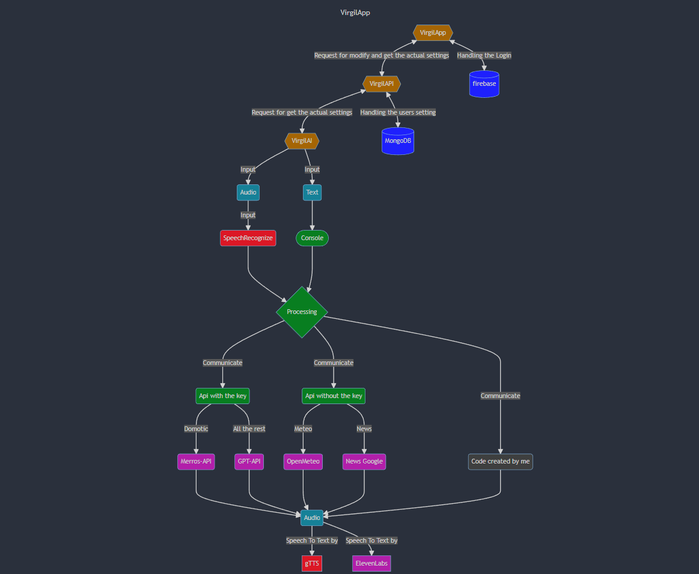
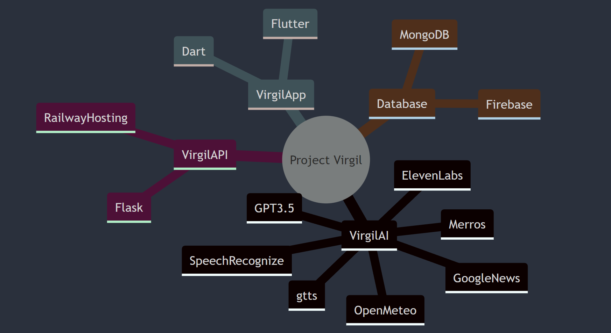

# Project Virgil

<p align="center">
 
 </p>
 

<p align="center">
  <a href="#-key-features">Key Features</a> •
  <a href="#-how-to-use">How To Use</a> •
  <a href="#-credits">Credits</a> •
  <a href="#-installing">Installing</a> •
  <a href="#to-be-considered">To be considered!</a> 
</p>

---

Created principle with [python3.11](https://www.python.org/downloads/) e various library like [SpeechRecognition ](https://pypi.org/project/SpeechRecognition/)  and [TTS library](https://pypi.org/project/gTTS/) 

Virgil or Virgil is a virtual assistant like Alexa or Google Home, but integrated with an AI (GPT-3.5 turbo).The project is focused on the virtual assistant, but it is actually divided into two, in fact there is its own Android [app](https://github.com/Retr0100/VirgilApp) created with Flutter dedicated with which you can set, change your settings of the virtual assistant just as you would with Alexa or Google Home.
ㅤㅤ

### **Virgil-AI** 

 


### **Virgil-App**


### **Virgil-API**

 


### **Virgil-WebSite**

 


## Chart on the functioning of Virgil
<p align="center">
 
</p>

## Structure
<p align="center">
 
</p>


## Component
<p align="center">
 
</p>


## 🔑 Key features
**You can ask lots of questions at Virgilio, like us:**
- The time ⏲️
- The weather 🌧️
- The lates news 🗞️
- Change the volume 🔉
- The temperature 🌡️
- Days of the week 📆
- Interact with the domotic (Merros device only) 💡
- Timer 🔂
- Ask a Virgil to remember your commitments 🗓️
- Mediaplayer 🎵
- and ask **whatever you want** like: Virgilio explain quantum math 🤖
  
**Is fast to use:**
- In fact all you have to do is insert the key in the app and you're done ✅
  
**Portable:**
- You can put it on any linux/windows device including mac 🌐
  


## 📋 Installing

1. The first part of the installation is to download all the files from the repository
   - command linee ```git clone https://github.com/Retr0100/VirgilApp.git```
   - or download the zip
2. Now we need the api (for now i am not rich and i do not pay for everything) so
 we are need of 3 api keys (the keys marked with * are mandatory for operation)
   - API for OpenAI and GPT, 
          i recommend this [video tutorial](https://www.youtube.com/watch?v=u-LeLPBZr2k) *
   - API for Merros (domotic socket),
          just create a [Merros account](https://www.meross.com/en-gc) and insert the credential 
   - API for ElevenLabs
       This API is not required, but if you want a [BEST EXPERIENCE](https://elevenlabs.io/speech-synthesis) i raccomand you to get

3. When you have all the keys/accounts, save them on any file

   

## Notes ❗

**THIS IS NOT OBLIGATORY.**  
 Before the user on Linux (preferably, but also on Windows it would not be) create an enviroment with venv ```python -m venv name_enviroment``` after writing ```source name_enviroment/bin/activate```.
 Now you can install all the dependencies without putting your PC at risk. 
 To close the environment, just run ```deactivate```.

## 📖 How to use
### When you have installed and downloaded the API you can start using Virgilio 🥡
 1. Open a terminal to the directory ProjectVirgil/setupAndLaunch and run the file with   ```setup.bat``` for windows or run the file bash ```bash setup.sh``` on linux (first make it execuble) instead for the fast start launch   ```python launch.py``` or  ```python3 launch.py```
 2. At a certain point you will be asked to install the dedicated app [**VirgilApp**](https://github.com/Retr0100/VirgilApp), this app will allow you to configure Virgilio and change the associated settings **BUT BEWARE IT IS NOT ESSENTIAL FOR THE USE OF VIRGILIO, VIRGILIO CAN ALSO BE USED WITHOUT THE USE OF THE APP** if you do not want to use the app [click here](#-configuration-without-app) 
 3. In the app, you will have to search for the **configuration page** (it will not be difficult to find it) and you will have to enter the **key** that will be shown to you on the screen when Virgilio is launched (you only have to do this step the first time, but you can **repeat** it if you want to [change the key](#-change-the-key))
 4. Now you can change the **settings** of Virgil on the corresponding page (Each time you change a setting in order to have the settings updated, you will have to restart Virgil)
 5. At the end of this initial configuration, which you only need to do once, you can press any key and choose to use a **text interface** (recommended for debugging) or a **voice interface** (recommended for personal use).

## 📚 Guide to setting

```
// THE VALUES ON THE JSON ARE THE DEFAULT
{
    "language": "it", //The launguage for now is useless sorry
    "wordActivation": "Virgilio", //The word on Virgil can Activate
    "volume": "100.0", // Set the start volume of Virgil
    "city": "Salerno", // City default for the Meteo
    "operation_timeout": "3", // Listening time if you don't tal 
    "dynamic_energy_threshold": "true", // Automatic and dynamic microphone sensitivity
    "energy_threshold": "3500", //Sensitivy of microphone                                     
    "elevenlabs": "aaaaaaaaaaaaaaaaaaaaaaaaaaaaaaaa", //Key for elevenlabs                  
    "openAI": "sk-aaaaaaaaaaaaaaaaaaaaaaaaaaaaaaaaaaaaaaaaaaaa", //Key for openAI
    "merrosEmail": "email", //Credential for merros                                                                
    "merrosPassword": "password", //Credential for merros                                                               
    "temperature": "0.9", //Randomness of GPT responses
    "max_tokens": "30" //Max lenght phrase of GPT                                                                       
}                                                                                                                      
```

### Why the key of OpenAI,ElevenLabs and Merros❓

- OpenAI: This is in fact the only mandatory key, as GPT covers 50% of the application, and this is the real **difference** to Alexa and Virgil.
- ElevenLabs: This key is not mandatory but it makes the experience more pleasant because ElevenLabs implements a more natural Speech To Text (TTS) and also allows you to choose your own voice.
  The key for the API is free and only requires registration (TIPS: If you run out of tokens and want to continue using elevenlabs free, create another account with the same email address, but put a dot anywhere before the "@" and the confirmation email will still arrive, but it will be a different email address for the site... **SHHH DON'T TELL ANYONE**) If you can't register, Virgil will still work, but with Google's TTS.
 and it's not the best choice 😅. 
- Meross: This credential an required **ONLY** if you can use a domotic Meross but if you dont have a domotic Meross don't waste time ⏲️

### How to change the voice for TTS ElevenLabs:

1. Go in this file ```lib/sound.py```
2. Go on the site of [ElevenLabs](https://elevenlabs.io/speech-synthesis) create an account (You should already have it)
3. Explore the default Voice and choice one
4. Now on this part of file ```sound.py```
    ```
    sound = generate(
                        api_key = self.API_KEY,
                        text=text,
                        voice="Antoni",
                        model='eleven_multilingual_v1'
                    )
    ```
    And replace the voice whith the one you want (if after the TTS dont'work try another voice on whatch a video on YT on how to use default entries )
5.  Restart Virgil

## 📃 Configuration without app

**not updated to revision**
1. In the main directory there is a file call ```settings.json``` in this file is present all the setting of Virgil open it
2. Now you can modify all the setting like API key, location etc
 
## 🔁 Change the key

> Go in the directory call setup and search the key.txt (remeber the key is a hexadecimal string of 32 characters),delete it and relaunch Virgil

## TO BE CONSIDERED ⚠️
1. The entire project is only at the albor and is not 100% complete
2. Virgilio without the API insert and without the connection will not function fully 
3. **FOR NOW** many command works only in italian except for the question at GPT (so any questions not covered by the default commands)
4. The api for GPT is almost free but is necessary inser the credit/debit card (sorry i know is annoying) 💸


## 💎 RoadMap for the ProjectVirgil

- [x] Make a beta of VirgilAI
- [x] Make a first Version of App
- [x] Increase the possibility of Virgil
- [ ] Improve the code design and make the code more efficent
- [ ] Create a website for the Project
- [ ] Improve the command reqcognition
- [ ] Add more language


## 💸 Credits and technologies used
Only me 💻 and

 - openAI API
 - OpenMeteo API
 - Merros API
 - MongoDB for Database of the setting
 - Flask for create the API
 - Flutter for create the mobile app (only android for now)
 - Firebase for the manage of account
 - EvenLabs API 

ps: follow me on [instagram](https://www.instagram.com/akiidjk) and [twitter](https://twitter.com/R3tr0_fj) contact me for help or support


